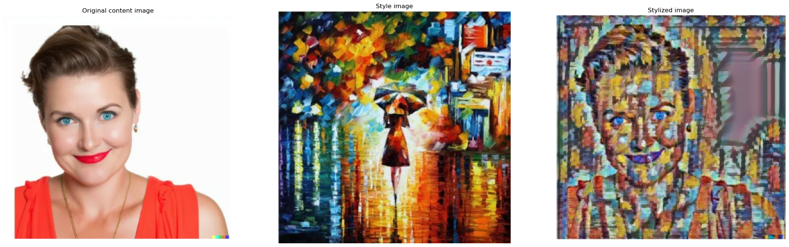

# 🎨🖼️ Neural Style Transfer & Super-Resolution Upscaling

This app combines the magic of Neural Style Transfer with High-Resolution Image Upscaling to create printable, large-format artistic images (e.g., A0 poster size). Built with 🐍 Python and Streamlit, it allows users to:

- Apply any artistic style to a content image

- Upscale the stylized image to ultra-high resolutions

- Download the final output for printing or sharing




### 🚀 Hosted on Hugging Face Spaces: [Your Hugging Face Space URL Here]
🌟 Features

    🎨 Arbitrary style transfer using TensorFlow Hub’s model

    🔍 Upscaling with Real-ESRGAN for sharp, printable results

    🖼️ Previews before and after stylization

    📐 Upscale sizes (4×)

    📦 Streamlit interface with live feedback and image downloads

### 🧠 How It Works

    Style Transfer: The TensorFlow Hub model (magenta/arbitrary-image-stylization-v1-256) stylizes the content image using the selected style image.

    Super Resolution: The stylized image is upscaled using the Real-ESRGAN model (x4plus or x4plus-anime) for stunning detail.

    Output: The final result can be downloaded as a high-res image suitable for printing (up to 300 DPI A0-size).

### 🛠️ Installation

To run locally:

git clone https://huggingface.co/spaces/your-username/your-repo-name
cd your-repo-name

# Install dependencies
pip install -r requirements.txt

# Or use pip if requirements.txt is not included:
pip install streamlit tensorflow tensorflow_hub realesrgan numpy opencv-python pillow

# Run the app
streamlit run app.py

📁 Project Structure
```bash
├── app.py               # Streamlit main application
├── utils.py             # Style transfer and upscaling functions
├── README.md            # This file
├── requirements.txt     # Python dependencies
├── input_images/        # Optional directory with default style images
└── output_images/       # Directory where output images are saved
```

### 🧠 Models Used

    🖌️ Style Transfer:

        Model: magenta/arbitrary-image-stylization-v1-256

        Source:  https://tfhub.dev/google/magenta/arbitrary-image-stylization-v1-256/2

    📈 Super Resolution:

        Model: Real-ESRGAN (x4plus or x4plus-anime)

        Source: https://github.com/xinntao/Real-ESRGAN

### 📦 Deployment on Hugging Face Spaces

*To deploy your app:*

    Create a Space: Go to https://huggingface.co/spaces and click "Create new Space"

    Select:

        SDK: Streamlit

        Name: neural-style-upscaler (or your choice)

    Upload the following files:

        app.py

        requirements.txt

        utils.py

        README.md

        Any sample images

    Push to Hugging Face:

    git lfs install
    git clone https://huggingface.co/spaces/your-username/your-repo-name
    cd your-repo-name
    cp -r ../your-local-files/* .
    git add .
    git commit -m "Initial commit"
    git push

